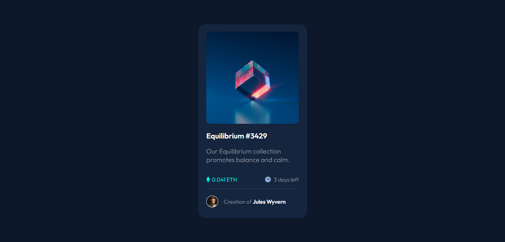
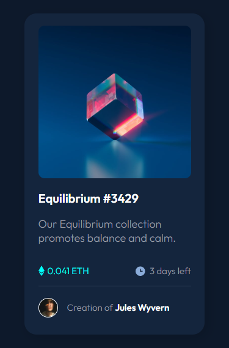

## Table of contents

- [Overview](#overview)
  - [The challenge](#the-challenge)
  - [Screenshot](#screenshot)
  - [Links](#links)
- [My process](#my-process)
  - [Built with](#built-with)
  - [What I learned](#what-i-learned)
- [Author](#author)

## Overview

So here's a small overiew of what you guys might need to do if you ever wanna build this app ~ Acme

### The challenge

Users should be able to:

- Use Media Queries to adjust the size of the web app
- Customize the look with rows and columns to
- Use the color palette and typoography to create a consistent look

### Screenshot

Here's a screenshot of my solution, and if you ever wanna add your own in your own repo, the easiest way to do this is to use a browser to view your project, and use your snipping tool to capture the image.

Normally I would use [Lightshot](https://app.prntscr.com/) or [Sharex](https://getsharex.com/) to take the screenshot with a hot-key. They both are free so you don't need to pay for them.

### Links

- Solution URL: [Front-End Mentor](https://www.frontendmentor.io/solutions/qr-code-challenge-rJ5cwo3S5)
- Live Site URL: [Github](https://github.com/AcmeGamers/NFT-Preview-Card)

## My process

### Built with

- HTML5
- CSS custom properties

### What I learned

I believe in practice being a main part of learning process, and repeatingly used previous concepts allows people to be more productive and faster. With this exercise, I was able to put a better refresher to my :before and :after pseudo-elements.

## Author

- [Website](https://acme.fatima-academy.com)
- Frontend Mentor - [@AcmeGamers](https://www.frontendmentor.io/profile/AcmeGamers)
- Twitter - [@Acme_Gamers](https://twitter.com/Acme_Gamers)
